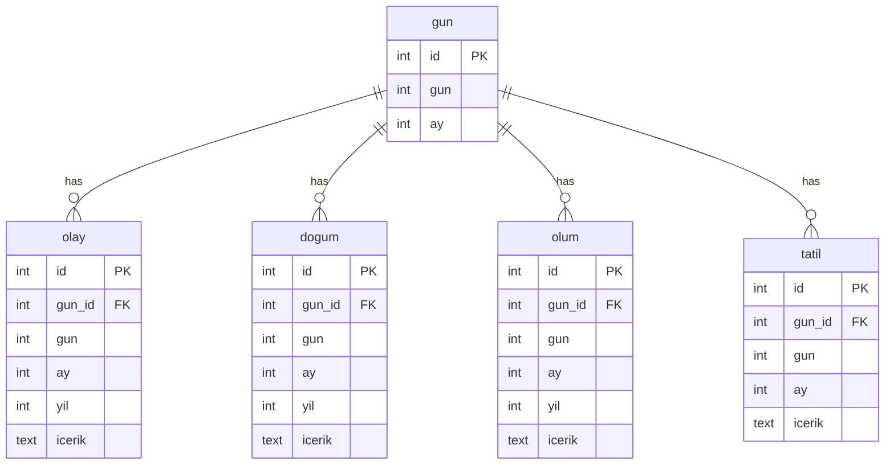

# Wikipedia Daily Events Database

This project scrapes daily events (births, deaths, events, and holidays) from Wikipedia and stores them in a Supabase database.

## Database ER Diagram



## Features

- Wikipedia data scraping (Turkish)
- Year-based event tracking
- Supabase database integration
- Automatic backup system (JSON)
- Error handling and logging
- Optimized bulk data import
- Transaction management for data integrity

## Database Structure

### Tables

1. `gun` (day) table
   - `id`: Unique identifier
   - `gun`: Day (1-31)
   - `ay`: Month (1-12)

2. `olay` (event), `dogum` (birth), `olum` (death) tables
   - `id`: Unique identifier
   - `gun_id`: Reference to day table
   - `gun`: Day (1-31)
   - `ay`: Month (1-12)
   - `yil`: Year of the event
   - `icerik`: Event details

3. `tatil` (holiday) table
   - `id`: Unique identifier
   - `gun_id`: Reference to day table
   - `gun`: Day (1-31)
   - `ay`: Month (1-12)
   - `icerik`: Holiday details

## Setup

1. Create a Supabase project and get your connection details.

2. Install required Python packages:
```bash
pip install -r requirements.txt
```

3. Configure Supabase connection:
   Create a `.env` file with the following variables:
   ```
   DB_HOST=your_supabase_host
   DB_PORT=5432
   DB_NAME=postgres
   DB_USER=your_supabase_user
   DB_PASSWORD=your_supabase_password
   ```

## Usage

1. Create database tables:
```bash
python create_table.py
```

2. Scrape data from Wikipedia:
```bash
python scrape.py
```

3. Import data to Supabase:
```bash
python bulk_data_import.py
```

## Performance Optimizations

- Bulk data import using `psycopg2.extras.execute_values`
- In-memory data processing without intermediate CSV files
- Separate transactions for each table import
- Efficient error handling and rollback mechanisms
- Optimized memory usage for large datasets

## Notes

- Data scraping process may take time
- Automatic backup every 10 days
- February is set to 29 days
- Full Turkish character support
- Data is scraped from Turkish Wikipedia
- SSL connection is required for Supabase

## Project Structure

- `scrape.py`: Wikipedia scraping script
- `create_table.py`: Database table creation
- `bulk_data_import.py`: Optimized data import to Supabase
- `requirements.txt`: Required Python packages
- Generated files:
  - `turkce_tum_gunler.json`: Scraped data backup

## Required Python Packages

- `psycopg2-binary`: PostgreSQL adapter for Supabase connection
- `python-dotenv`: Environment variable management
- `requests`: HTTP requests for scraping
- `beautifulsoup4`: HTML parsing 